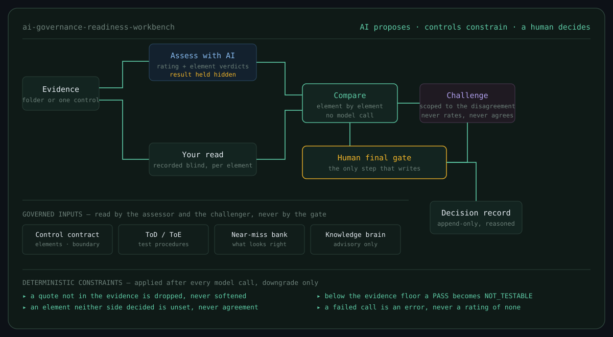

<h1 align="center">AI Governance Readiness Workbench</h1>

<p align="center">
  <em>A governed second-line AI assurance workbench.<br>
  AI proposes. Deterministic controls constrain. A named human decides.</em>
</p>

<p align="center">
  
</p>

---

## What it does

The workbench reads supplied evidence against governed control requirements, proposes an assessment, records a reviewer's independent read, compares the two element by element, challenges the disagreement, and writes a reasoned decision attributable to a named person.

It does **not** declare regulatory compliance. It rates how far supplied evidence supports a control, and it is built so that every number it produces can be traced to a quote, a requirement version and a person.

Coverage spans five control libraries — MAS AIRG, MAS SAFR, IMDA Model AI Governance Framework for Agentic AI, ISO/IEC 42001 and NIST AI RMF — across 195 controls. Inference is local by default, so evidence never leaves the machine.

## The design rule

Every model call in this repository is followed by deterministic checks that can only **downgrade**, never upgrade. A model cannot talk its way past them, and neither can a reviewer in a hurry.

| Rule | Why it exists |
|---|---|
| A quote not verbatim in the evidence is dropped | Fluent invention is the failure mode that survives review |
| An element neither side decided is `unset` | Silence is not agreement and must not be counted as it |
| Below the evidence floor, a `PASS` becomes `NOT_TESTABLE` | A result over one record is not a result |
| A failed model call is an error, never a rating | A run that did not happen must not resemble one that found nothing |
| A stale requirement binding makes label comparison `NOT_TESTABLE` | A label means something only while it describes the requirement it was argued against |
| A decision reason that repeats the decision word is refused | 47 accepts to 4 amends, every reason reading "accept", is not an accountability record |

## Operating model

**Assess with AI** answers *what does this evidence support?* It receives the evidence, the control contract, the ToD/ToE methodology, the near-miss bank and advisory knowledge. It returns a rating and a verdict per requirement element, each `met` carrying a verbatim quote. It cannot write.

**Your read** is recorded blind. The AI proposal is computed ahead of time and held hidden until the reviewer has committed their own reading — blindness is about what the reviewer was shown, not when the call was made, so batch assessment still runs ahead.

**Compare** is a pure function with no model call. It diffs the two reads element by element against the same contract and reports what was compared, what was not, and where they disagree.

**Challenge** attacks the disagreement rather than either read. It must state which side the evidence supports — `reviewer`, `assessor` or `neither` — and a challenge naming an element outside the disagreement is dropped before validation. It never rates and never agrees. An empty result is a valid result.

**Human final gate** is the only step that writes. Accept, reject, request evidence, override or escalate, with a reason that is checked for substance.

## Getting started

```bash
git clone https://github.com/<you>/ai-governance-readiness-workbench.git
cd ai-governance-readiness-workbench
python -m venv .venv && source .venv/bin/activate
pip install -r requirements.txt

ollama pull llama3.1:8b
ollama pull nomic-embed-text

# Optional deeper challenger: Colibri
export WB_COLIBRI_ENABLED=1
export COLIBRI_BASE_URL=http://127.0.0.1:8000/v1
export COLIBRI_MODEL=glm-5.2-colibri

streamlit run app.py
```

On the Scan tab, choose **Try it with synthetic evidence** to generate a document for every control and walk the whole workflow without client material.

> The synthetic pack is generated **from** the control contracts, so it reuses the requirement wording. Retrieval and assessment both look better against it than against real documents. Use it to learn the workflow, never as a measurement.

## Models

| Variable | Default | Used by |
|---|---|---|
| `OLLAMA_MODEL` | `llama3.1:8b` | shared Ollama fallback |
| `WB_MODEL_ASSESS` | `OLLAMA_MODEL` | assessor |
| `WB_MODEL_ELEMENTS` | `OLLAMA_MODEL` | element pass |
| `WB_MODEL_CHALLENGE` | `OLLAMA_MODEL` | both challenger passes when routed to Ollama |
| `WB_PROVIDER_CHALLENGE_DISAGREEMENT` | policy-selected | explicit provider override for disagreement challenge |
| `WB_COLIBRI_ENABLED` | `0` | route difficult challenge work to Colibri when `1` |
| `COLIBRI_BASE_URL` | `http://127.0.0.1:8000/v1` | Colibri OpenAI-compatible API |
| `COLIBRI_MODEL` | `glm-5.2-colibri` | Colibri model id |
| `WB_CHALLENGE_FALLBACK_PROVIDER` | unset | alternate provider after a challenge transport/validation failure |
| `WB_JUDGE_MODEL` | `llama3.1:8b` | lifecycle step judge |
| `WB_EMBED_MODEL` | `nomic-embed-text` | hybrid retrieval |
| `ASSESSOR_MODEL` | `claude-sonnet-4-6` | the Anthropic path, which policy requires a registered exception to use |
| `WB_ELEMENT_PASS` | `split` | `split`, `combined` or `off` |

The challenger sets the floor on model quality, not the assessor: its schema carries thirteen required fields per challenge plus two independently verifiable pointers, and validation raises rather than degrades. `llama3.1:8b` is the recommended minimum. The Ollama challenger retries deterministic validation failures with a repair prompt but still raises rather than recording unsupported output. Everything runs at temperature 0 with a fixed seed, so a run reproduces.

Colibri is an OpenAI-compatible local provider used by the inference policy for difficult challenge work. With `WB_COLIBRI_ENABLED=1`, reviewer/assessor disagreements, high-risk challenges and critical challenge tasks route to Colibri; routine challenge work remains on the normal Ollama path. Provider choice and the final model are recorded in `governance/inference_tasks.jsonl`. See `RUNBOOK_LLM_SERVICES.md` for the two-service startup sequence.

## Measuring it

Nothing here is trusted because it looks articulate.

```bash
python -m pytest -q
python tools/probe_wb031.py --controls M3.6 --evidence eval/corpus/M3.6 --mode both
```

The probe reports whether the model returns usable element verdicts at all — `unset`, `downgraded` and `met` — separately from whether those verdicts are correct. The second question is gated on the corpus still being bound to the requirement its labels were argued against, and the probe refuses to report label agreement when it is not.

## Repository layout

```
app.py                  Streamlit workbench
assessor.py             rating + element verdicts, and the validators over both
challenge.py            challenge pass 1 (the reviewer) and pass 2 (the disagreement)
compare.py              deterministic element-level diff
judge.py                lifecycle step judge
retriever.py            hybrid BM25 + embedding retrieval
scanner.py pipeline.py  evidence indexing and matching
folder_picker.py        evidence folder browsing
caa/  controls/         deterministic control testing lane
governance/             contracts, knowledge brains, ticket register, decision log
policy/                 policy-as-code — the golden state and the gate rules
eval/                   golden set, constructed corpus, scoring
stress/                 adversarial probes against the assessor and the judge
tools/                  build and measurement scripts
```

## Status and limitations

This is a working research build, not a product. Stated plainly, because a governance tool that overstates itself is the thing it exists to catch:

- **Element decomposition is authored for 30 MAS controls.** The other 165 carry archetype-derived drafts marked `DRAFT, requires second-line authoring`. That marker is currently dropped between the contract and the assessor prompt — a known gap.
- **No accuracy claim is supported today.** The evaluation corpus labels were argued against a superseded requirement decomposition, so label comparison correctly reports `NOT_TESTABLE` until they are re-argued.
- **The constructed corpus covers two controls** of the six to eight planned.
- **51 historical step decisions carry hollow reasons.** The validation that prevents this now exists; the existing records cannot be honestly retro-filled and are kept as they are.
- **Streamlit UI code is not unit-tested.** The rest of the repository is.

## License

See `LICENSE`.

## v0.9.6 direction

Inference engineering is a control-plane concern: it allocates model compute, validates outputs and
escalates difficult work. Plugins and tools observe/test systems and return provenance-bearing data;
they do not interpret controls or perform remediation by default. M3.6 demonstrates the pattern with
atomic requirement elements plus advisory verification metadata.

## Full governed-control semantic coverage

The governance engine now carries a semantic registry for the full governed inventory:

- **195/195 controls** have a reviewer-facing semantic record.
- **284/284 requirement elements** have intent, governed text, applicability, expected evidence, verification mode, and source basis.
- **19 elements** currently have executable deterministic predicates (M3.6 and MGF Agentic D1.2).
- **264 elements** remain explicitly `HUMAN_JUDGEMENT`; no invented Boolean predicates are used to create a false sense of automation.
- **1 element** is explicitly `OUT_OF_BAND`.

The instrument corpus is used as a grounding source for MAS, MGF Agentic, SAFR and NIST. ISO 42001 is grounded to the repository's Requirement Element Audit/workbook because no ISO instrument file is present. Instrument matches are provenance candidates, not regulatory sign-off.

The registry is in `governance/knowledge/semantic_registry.yaml`; the coverage summary is in `SEMANTIC_COVERAGE.md`.

Importantly, the semantic registry is separate from runtime verdicts: **semantic coverage tells the reviewer what the element means and how it is intended to be verified; ControlResult tells the reviewer what the currently observed evidence establishes.**
